# 🤖 Antigravity Workflows & Lifecycle

This repository contains the high-fidelity development lifecycle and **deterministic architectural axioms** used by **Antigravity**. It provides a structured framework for agents to build, review, and maintain a codebase designed for machine parsing, atomic modularity, and zero-hallucination logic.

---

## 🗺️ The Three-Epoch Model

```mermaid
graph TD
    subgraph "Epoch 1: The Architect (High Reasoning)"
        A["Discovery (/create-issue)"] --> B["Design (/create-plan)"]
    end
    
    B --> CP1["🛑 Human Checkpoint: Schema & Plan Approval"]
    
    subgraph "Epoch 2: The Builder (High Speed/Accuracy)"
        CP1 -->|FRESH CHAT| C["Build (/execute)"]
        C --> D["Peer Review (/peer-review) using external LLM"]
        D --> E["Synthesis (/synthesis)"]
    end
    
    E --> CP2["🛑 Human Checkpoint: Code Approval"]
    
    subgraph "Epoch 3: The Historian (Analysis/Synthesis)"
        CP2 -->|FRESH CHAT| F["Hygiene (/close-issue)"]
    end
```



---

## 🏗️ Epoch 1: The Architect 🧠
**Goal**: Produce a rigorous, approved implementation plan.
*   **Focus**: Brainstorming, Q&A, and architectural mapping.
*   **Tasks**: `create-issue` and `create-plan`.
*   **Handoff**: Once the `implementation_plan.md` is approved, the session ends.

## 🛠️ Epoch 2: The Builder 🏗️
**Goal**: Execute the code with maximum focus and zero noise.
*   **The Fresh Start**: Start a **NEW CHAT**. Feed the agent the approved **implementation_plan.md**.
*   **Focus**: Strict adherence to the blueprint using the `execute` workflow.
*   **Verification**: Passing the **Quad Gate** at every step.
*   **Audit**: Run `peer-review` with a different model (e.g., Claude Opus) to catch edge cases, then use `synthesis` to integrate valid signal and fix bugs.

## 📚 Epoch 3: The Historian 📖
**Goal**: Repository hygiene and long-term memory consolidation.
*   **The Fresh Start**: Start a **NEW CHAT**. Feed the agent the **git diff** of changes and **AGENTS.md**.
*   **Tasks**: Update docs, CHANGELOG, and perform the "Closing Ritual" in `close-issue`.

---

## 🔄 Why "Epochs"?
| Feature | Three-Epoch Model | why? |
| :--- | :--- | :--- |
| **Context** | Pristine. Only stage-relevant info. | Prevents hallucination from brainstorming noise. |
| **Efficiency** | Optimized token usage. | Builder doesn't pay for Architect's debates. |
| **Safety** | Hard gates for human approval. | Ensures the agent never builds the wrong thing perfectly. |

---

## 🛠️ Utility Workflows
These workflows can be summoned at any time to assist with the development process.

*   **`cto`**: Technical brainstorming and plan critique. Use this to ensure your architecture is sound before committing to a plan.
*   **`learning-opportunity`**: Deep dive into technical topics. Use this to build intuition about the "why" behind architectural decisions.

---

## 🔄 How to Use
Always use the slash commands. They aren't just names; they are **enforced state machines** that maintain the quality of the project.

### 📥 Installation / Maintenance
To install/update these workflows into your project, run this from your **project root**:

```bash
git clone https://github.com/nickconstantinou/antigravity-workflows.git temp-wf && cp -r temp-wf/.agent . && rm -rf temp-wf
```

> [!TIP]
> **Stuck?** Refresh your memory by reading the specific workflow files in [the directory](file://./.agent/workflows/create-plan.md).